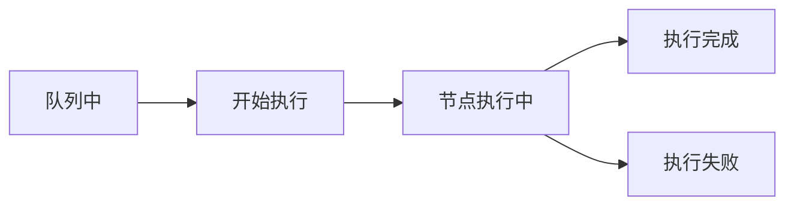

# 数据流转过程
## 1. 初始化连接：
```python
client_id = str(uuid.uuid4())  # 生成唯一ID
ws.connect("ws://{}/ws?clientId={}") # 建立WebSocket连接
```
## 2. 任务提交：
```python
prompt_id = queue_prompt(prompt)['prompt_id']  # 获取任务ID
```

ComfyUI的服务器实现中（server.py），有一个执行器（Executor）负责管理任务状态，状态流转过程如下：


```python
def get_images(ws, prompt):
    prompt_id = queue_prompt(prompt)['prompt_id']
    output_images = {}
    
    while True:
        out = ws.recv()
        if isinstance(out, str):
            message = json.loads(out)
            if message['type'] == 'executing':
                data = message['data']
                if data['node'] is None:  # 所有节点执行完成
                    break
                # 否则继续等待下一个节点的执行
```
每个节点执行时，服务器都会发送一个executing状态消息，包含当前执行的节点ID。当所有节点执行完成时，发送一个node: None的状态消息。

## 3. 状态监听：
```python
while True:
    message = json.loads(ws.recv())
    if message['type'] == 'executing':
        # 监控执行状态
```
## 4. 结果获取：
```python
history = get_history(prompt_id)  # 获取执行结果
```
